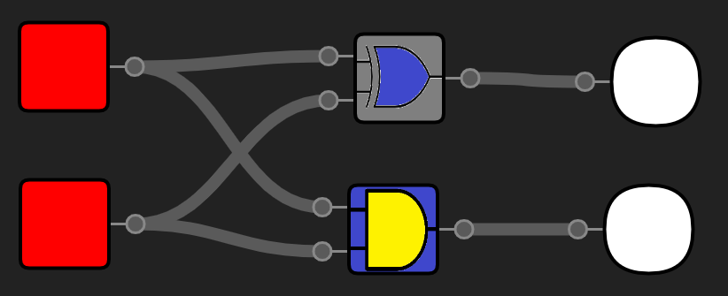
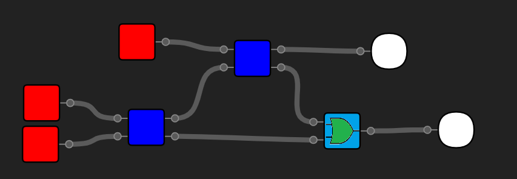
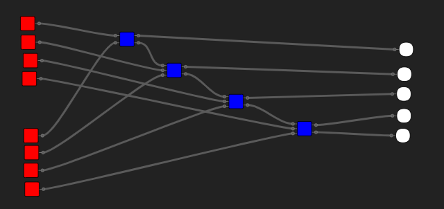

<link rel="stylesheet" href="https://fonts.googleapis.com/icon?family=Material+Icons">

## Running the simulator

There are 3 ways to get the simulator up and running:

1. Using [the version hosted on heroku](https://logic-gate-simulator.herokuapp.com/):

This is by far the fastest solution - everything you need to do is open
[the github-pages url](https://logic-gate-simulator.herokuapp.com/)

2. Using a development server:

First you need to have [node.js & npm](https://nodejs.org/en/download/) and [git](https://git-scm.com/book/en/v2/Getting-Started-Installing-Git) installed on your machine.

Open a terminal in the desired folder and run:

```sh
#  Clone repo
git clone https://github.com/Mateiadrielrafael/logicGateSimulator

# Cd into the folder
cd logicGateSimulator

# install dependencies
npm install

# run development server
npm run dev
```

3. Building the simulation yourself

First, clone the repo and install the dependencies as explained in option 2.

To build the source run:

```sh
# build program
npm run build
```

To then run the simulation, open a server in the dist directory. A simple solution using npm:

```sh
# instal nano-server globally
npm i nano-server -g

# change directory
cd dist

# run server
nano-server

# linux
open http://localhost:5000

# Windows
start http://localhost:5000
```

## Building a 4 - bit adder:

1. Create a new ic called `half-adder` (`Create simulation` > `Integrated circuit` > `Half adder`)

2. Add the following logic gates (`Logic gates` > the name of the gate):
    - 2 buttons
    - 2 light bulbs
    - a XOR gate
    - an AND gate

> You can get more info about these gates by clicking `Logic gates` > the <i class='material-icons'>info</i> icon at the rght of the gate.

3. To move a gate, drag & drop it with the right mouse button. To connect 2 pins, click once on each. Build the following configuration:



3. Create a new ic called `full-adder` (See step 1)
4. Add the following gates (See step 2):
    - 3 buttons
    - 2 light bulbs
    - 2 half adders
    - an OR gate

5) Build the following configuration (See step 3):
   

6) Create a new project called `4-bit-adder` (`Create simulation` > `Project` > `4-bit-adder`)

7) Add the following components (See step 2):

    - 8 button
    - 5 light bulbs
    - 3 full adders
    - 1 half adder

8) Build the following configuration (See step 3):
   

9) Enjoy!
   Congratiulations! You've made your first circuit! With this simulator at your dispossal, the possibilities are endless! Here are a few things you can try and create yourself: - A 4-bit substractor - A counter - Different latches - If you are confident in you skills, you can even make a full 4-bit processor!

## The controls

|               Action                |       Keybinding        |                                     Gui                                      |
| :---------------------------------: | :---------------------: | :--------------------------------------------------------------------------: |
|                Save                 |       `ctrl + s`        |                            `Simulation` > `Save`                             |
|             Add a gate              |            -            |                click `logic-gates` > the gate you want to add                |
|             Move a gate             |            -            |             drag & drop the gate using the `right mouse button`              |
|                 Pan                 |            -            |    click & move & release the background useing the `right mouse button`     |
|        Select multiple gates        |            -            |             click & move & release using the `left mouse button`             |
|          Add to selection           |         `shift`         |                         select while holding `shift`                         |
|          Select all gates           |       `ctrl + a`        |                         `Simulation` > `Select all`                          |
|          Delete selection           |        `delete`         |                      `Simulation` > `Delete selection`                       |
|        Undo _(to last save)_        |       `ctrl + z`        |                            `Simulation` > `Undo`                             |
|     Refresh (reload) simulation     |       `ctrl + r`        |                           `Simulation` > `Refresh`                           |
|  Clean (delete unconnected gates)   |     `ctrl + delete`     |                            `Simulation` > `Clean`                            |
|          Delete simulation          | `ctrl + shift + delete` |                      `Simulation` > `Delete simulation`                      |
|           Open simulation           |            -            |             `Open simulation` > the simulation you want to open              |
|          Create simulation          |            -            |                       `Create simulation` > `Project`                        | `Integrated circuit` > type the name of the simulation |
|           Create project            |            -            |      `Create simulation` > `Project` > type the name of the simulation       |
|      Create integrated circuit      |            -            | `Create simulation` > `Integrated circuit` > type the name of the simulation |
|           Change language           |            -            |     Click on the `Language: \<language\>` button (bottom of the sidebar)     |
| Get more info about a built in gate |            -            |              `Logic gates` > <i class="material-icons">info</i>              |
