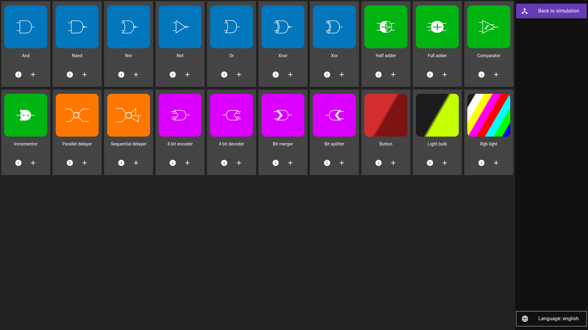
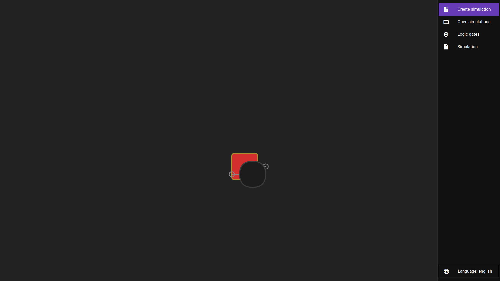

# Basic opeartions

To demonstrate the basic usage of the simulator we will construct one of the simplest logic gates: the `buffer` gate.

First of all we need to create something called an `integrated circuit`. You can think of integrated circuits like a box containing some components. You only put the components there once and can then reuse that box as many times as you want.

To create an integrated circuit, click on `Create simulation`, then on `integrated circuit` and type in the name of the circuit - in this case `buffer`.

You should see something like this:

Now we need to actually add some logic gates. To do that you need to:

1. click on `Logic gates`, which should bring up a screen which looks similar to this:

    

2. Click on the logic gates you want to add to your integrated circuit! In our case we need to add a `button` and a `light bulb`

    > After you add any logic gate you should get a confirmation message which looks something like this: 

3. To go back to the simulation view click the `Back to simulation` button. Now you should see something like this:

    

4. As you probably noticed, the components are on top of eachother. You can use your right mouse button to drag them around!

    > Note 1: while your mouse is outside of gate you can start a selection. After you selected some gates you can use your mouse to drag all of them.

    > Note 2: this isn't limited to movement. In the future you'll learn about many actions you can perform which also work on multiple gates :D

    > Note 3: While we're on the topic of selection: You can use `ctrl + a` (or `command + a` on macs) to select everything
