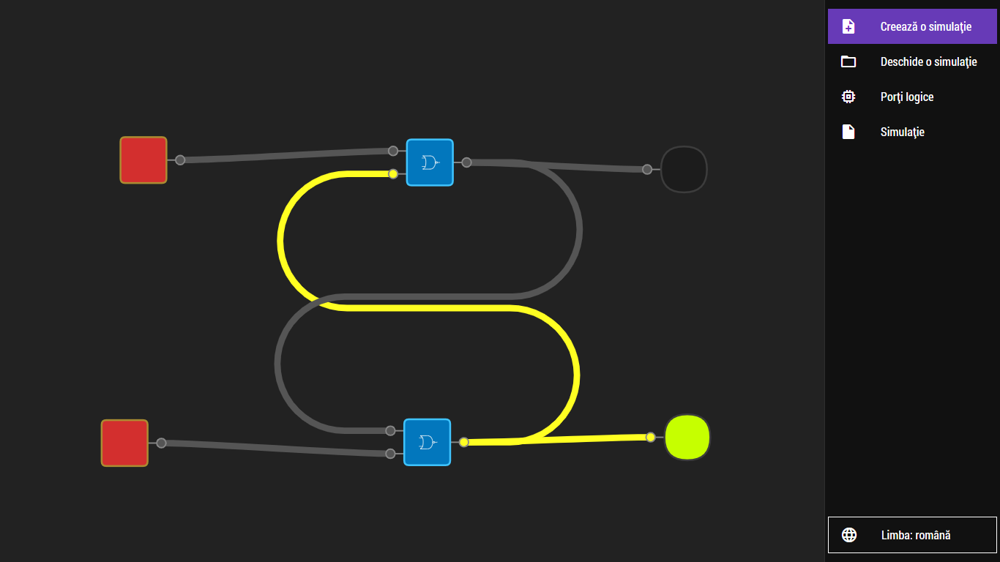

# Ghid de utilizare a aplicatiei

Pentru a explica utilizarea functiilor de baza ale aplicatiei, urmatoarea secventa va parcurge procesul de creeere a unui latch SR:

1. Creeerea unei noi simulatii:

    - se apasa butonul „Create simulation” de pe bara din dreapta, se da click pe "project" si se tasteaza numele dorit.

2. Adaugarea componentelor neccesare:

    - se utilizeaza butonul „logic gate” de pe bara din partea dreapta, si se adauga urmatoarele componente: 2 x „button” 2 x „light bulb” 2 x „nor gate”.

3. Conectarea componentelor:

    - pentru a crea un cablu se apasa pe 2 pini (unul de input si unul de output)
    - pentru a sterge un cablu se apasa pe pinul de output al cablului
    - pentru a misca un component se utilizeaza butonul din stanga al mouseului
    - se conecteaza componentele in cunoscuta configuratie a latchului SR:

        

    - prin apasarea butoanelor se poate testa latchul, care ar trebui sa respecte cunosctul tablel de adevar:

        |  S  |  R  |   Q   | not Q |
        | :-: | :-: | :---: | ----- |
        |  0  |  0  | latch | latch |
        |  0  |  1  |   0   | 1     |
        |  1  |  0  |   1   | 0     |
        |  1  |  1  |   0   | 0     |
